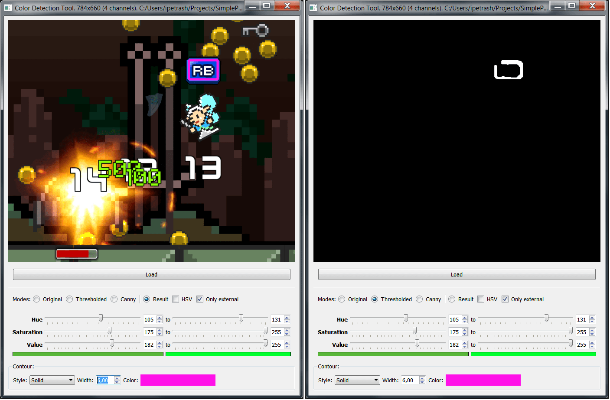

# Утилита для поиска объектов по цвету

Переписана с с++ на python.

Исходный код взят из: http://itnotesblog.ru/note.php?id=272#sthash.e5tCuHk0.dpbs

Нужно еще в README написать как эта утилита помогла и для какого именно дела использовалась

##

Утилита пригодилась при написании [бота для игры Buff Knight Advanced](https://github.com/gil9red/SimplePyScripts/tree/master/Bot%20Buff%20Knight%20Advanced)

В cv2 есть функция inRange. В нее передается изображение в HSV и минимальный и максимальный цвет в HSV.

Значения минимального и максимального цвета были получены из этой утилиты.

##

