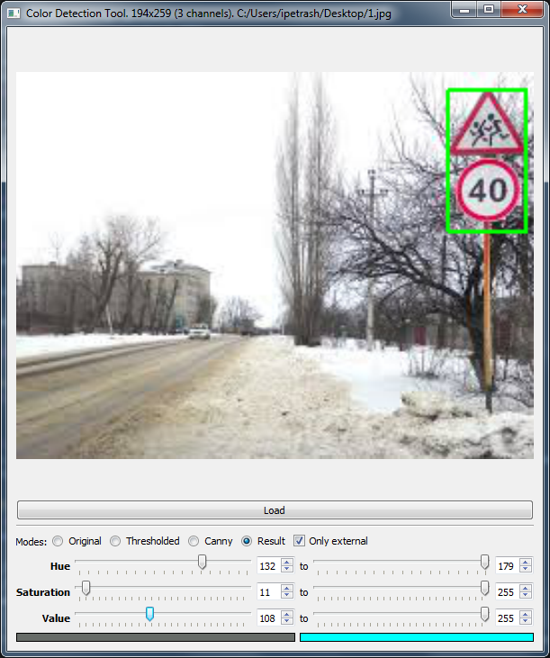
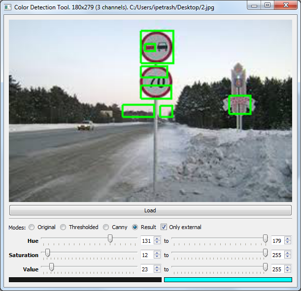
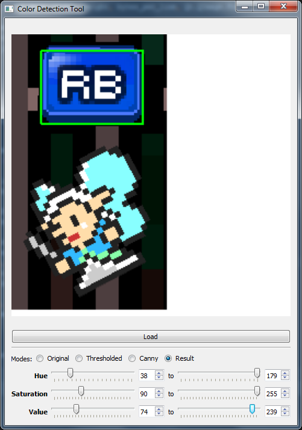

# Утилита для поиска объектов по цвету

Переписана с с++ на python.

Исходный код взят из: http://itnotesblog.ru/note.php?id=272#sthash.e5tCuHk0.dpbs

#### Генерация кода формы:

`pyuic5 -x mainwidget.ui -o mainwidget_ui.py`

##

