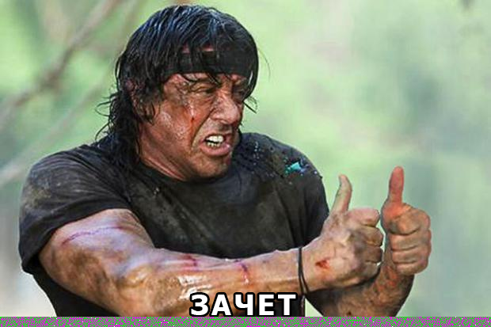

Решение вопроса №19 из https://pikabu.ru/page/interview/fullstack/

    19. Секретный агент Пикабу передал зашифрованное изображение. Вам необходимо расшифровать изображение и вывести его
    на страницу средствами JS (без сторонних библиотек). Алгоритм дешифрования известен:
        * пиксели перебираются слева направо для каждой строки;
        * для каждого пикселя вычисляется параметр s += x + y * 80 (изначально s = 0 и для каждого следующего пикселя
          значение увеличивается на x + y * 80), где x - колонка пикселя, y - строка;
        * для канала красного и синего цвета необходимо добавить параметр s;
        * для канала зеленого цвета необходимо отнять параметр s следующим образом: green = (green - s) & 0xff;

##

Исходная картинка:

Результат:

