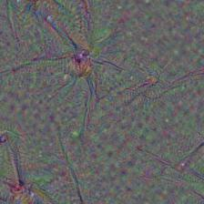
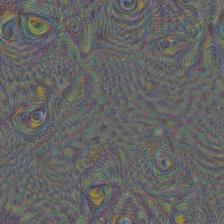
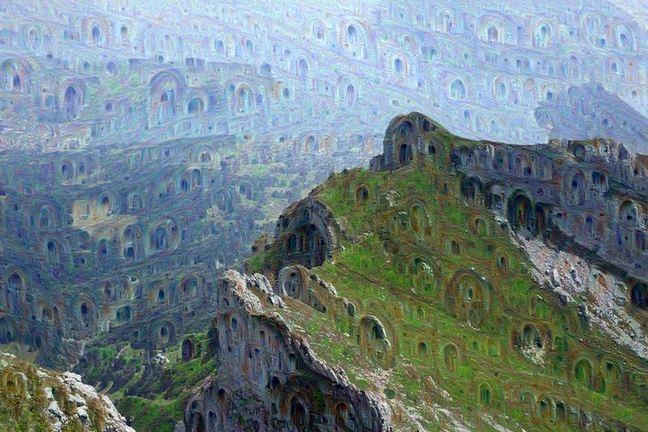

tensorflow__deep_dream
===========

# Examples:

## From Noise:

##### Layer "head1_bottleneck_pre_relu", channel 1

##### Layer "mixed4d_5x5_pre_relu", channel 61

## From pilatus800.jpg

##### Original:

##
##### Layer "mixed4c_3x3_bottleneck_pre_relu", channel 64

##
##### Layer "mixed4c_3x3_bottleneck_pre_relu", channel 104

##
##### Layer "mixed4d_1x1_pre_relu", channel 39

##
##### Layer "mixed4d_5x5_pre_relu", channel 61

